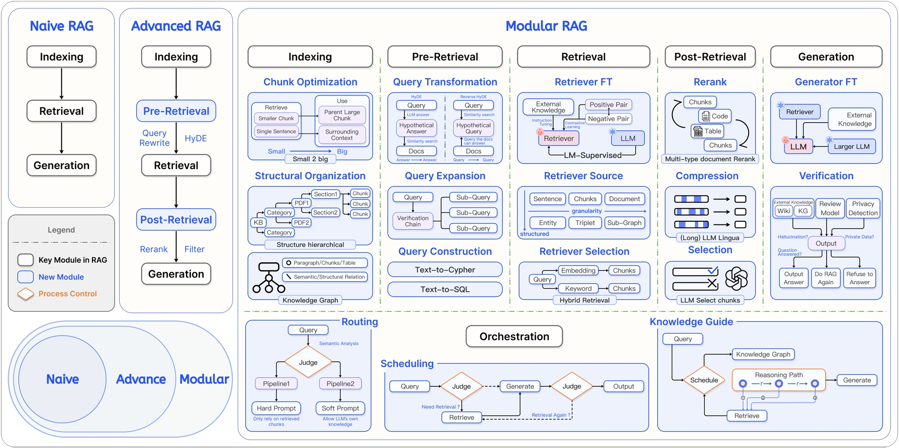
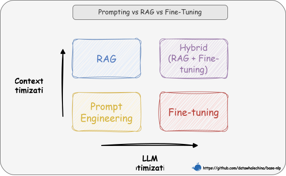

# Chapter 1: Introduction to RAG

## 1. What is RAG?

### 1.1 Core Definition

In essence, RAG (Retrieval-Augmented Generation) is a technical paradigm designed to solve the problem of large language models (LLMs) "knowing things without knowing why." Its core idea is to combine the **"Parametric Knowledge"** learned internally by the model (i.e., the solidified, fuzzy "memory" in its weights) with **"Non-parametric Knowledge"** from external knowledge bases (i.e., precise, externally updatable data).

In plain terms, its operational logic is to dynamically retrieve relevant information from an external knowledge base before the LLM generates text, and integrate these "reference materials" into the generation process, thereby improving the output's accuracy and timeliness [^1] [^2] [^3].

> 💡 **In one sentence**: RAG teaches an LLM to perform an "open-book exam," allowing it to use both what it has learned and what it can look up.

### 1.2 Technical Principles

So, how does a RAG system achieve this combination of "parametric" and "non-parametric" knowledge? As shown in Figure 1-1, its core architecture accomplishes this process through two main phases:

1.  **Retrieval Phase: Finding "Non-parametric Knowledge"**
    -   **Knowledge Vectorization**: The **Embedding Model** acts as a "connector." It first encodes the external knowledge base into a vector index and stores it in a **Vector Database**.
    -   **Semantic Recall**: When a user makes a query, the retrieval module uses the same embedding model to vectorize the question and, through **Similarity Search**, precisely locates and recalls the most relevant document chunks from the vast data.

2.  **Generation Phase: Fusing the Two Types of Knowledge**
    -   **Context Integration**: The generation module receives the relevant document chunks from the retrieval phase and the user's original query.
    -   **Instructed Generation**: This module follows a preset **Prompt** to effectively integrate the context with the query and guides an LLM (like DeepSeek) to perform controlled, well-reasoned text generation.

   
   
Figure 1-1 RAG Two-Stage Architecture Diagram

### 1.3 Technical Evolution Classification

The technical architecture of RAG has evolved from simple to complex, which can be broadly divided into three stages as shown in Figure 1-2 [^4].

   
   
Figure 1-2 RAG Technical Evolution Classification

| | **Naive RAG** | **Advanced RAG** | **Modular RAG** |
|:---:|:---:|:---:|:---:|
| **Flow** | **Offline:** `Index` **Online:** `Retrieve → Generate` | **Offline:** `Index` **Online:** `...→ Pre-retrieve → ... → Post-retrieve → ...` | "LEGO-like" orchestrable flow |
| **Core Feature** | Basic linear flow | Adds optimization steps **before/after retrieval** | Modular, composable, dynamically adjustable |
| **Key Tech** | Basic vector retrieval | **Query Rewrite** **Rerank** | **Routing** **Query Transformation** **Fusion** |
| **Limitations**| Unstable performance, hard to optimize | Relatively fixed flow, limited optimization points | High system complexity |

> "Offline" refers to pre-processing work done in advance (like index construction); "Online" refers to the real-time processing flow after a user request.

## 2. Why Use RAG?

### 2.1 Technical Selection: RAG vs. Fine-tuning

When choosing a technical path, a key consideration is the balance between cost and benefit. Typically, we should prioritize the solution with the least modification to the model and the lowest cost, so the technical selection path often follows this order:

**Prompt Engineering -> Retrieval-Augmented Generation -> Fine-tuning**.

We can understand the differences between these techniques from two dimensions. As shown in Figure 1-3, the **horizontal axis represents "LLM Optimization"**—the degree to which the model itself is modified. From left to right, the level of optimization deepens; Prompt Engineering and RAG do not change model weights at all, while Fine-tuning directly modifies model parameters. The **vertical axis represents "Context Optimization"**—the degree to which the information provided to the model is enhanced. From bottom to top, the level of enhancement increases; Prompt Engineering only optimizes the way questions are asked, while RAG vastly enriches the context by introducing an external knowledge base.

  
  
Figure 1-3 RAG, Fine-tuning, and Prompt Engineering Technical Selection Path

Based on this framework, our selection path becomes clear:
- **First, try Prompt Engineering**: Guide the model by carefully designing prompts, suitable for simple tasks where the model already has relevant knowledge.
- **Then, choose RAG**: If the model cannot answer due to a lack of specific or real-time knowledge, use RAG to provide contextual information through an external knowledge base.
- **Finally, consider Fine-tuning**: When the goal is to change "how" the model does something (behavior/style/format) rather than "what" it knows (knowledge), Fine-tuning is the ultimate and most appropriate choice. For example, teaching the model to strictly follow a unique output format, mimic a specific character's dialogue style, or "distill" extremely complex instructions into the model weights.

RAG bridges the gap between general-purpose models and specialized domains, and it is particularly effective at addressing the following core limitations of LLMs:

| Problem | RAG Solution |
|---------------------|----------------------------------|
| **Static Knowledge Limitation** | Real-time retrieval from external knowledge bases, supporting dynamic updates |
| **Hallucination** | Generation based on retrieved content, reducing error rates |
| **Lack of Domain Expertise** | Introduction of domain-specific knowledge bases (e.g., medical/legal) |
| **Data Privacy Risks** | Local deployment of knowledge bases, avoiding sensitive data leakage |

### 2.2 Key Advantages 

**1. Dual Improvement in Accuracy and Trustworthiness**

The core value of RAG lies in breaking through the limitations of the model's pre-trained knowledge. It not only **fills knowledge gaps in specialized domains** but also effectively **suppresses the "hallucination" phenomenon** by providing concrete reference materials. Research also shows that RAG-generated content is significantly superior in **Specificity** and **Diversity** compared to pure LLMs. More importantly, RAG provides **traceability**—every answer can be traced back to its original source document, which greatly enhances the credibility of the content in serious contexts like law and medicine.

**2. Timeliness Guarantee**

In terms of knowledge updates, RAG solves the inherent **knowledge cutoff problem** of LLMs (i.e., the model is unaware of events after its training date). RAG allows the knowledge base to be **dynamically updated** independently of the model. This capability is referred to in papers as **"Index Hot-swapping"**—like swapping a memory card in a robot, it instantly switches the world knowledge base without retraining the model, enabling real-time knowledge.

**3. Significant Overall Cost-Effectiveness**

From an economic perspective, RAG is a highly cost-effective solution. First, it **avoids the huge computational costs of frequent fine-tuning**. Second, with the powerful assistance of external knowledge, we can often use **smaller base models** to achieve similar results on specific domain problems, directly reducing inference costs. This architecture also reduces the resources needed to forcibly "stuff" massive amounts of knowledge into model weights.

**4. Flexible and Modular Scalability**

The RAG architecture is highly inclusive, supporting **multi-source integration** from data like PDFs, Word documents, or web pages into a unified knowledge base. At the same time, its **modular design** decouples retrieval and generation, meaning we can independently optimize the retrieval component (e.g., by swapping in a better embedding model) without affecting the stability of the generation component, facilitating long-term system iteration.

### 2.3 Risk-Graded Application Scenarios 

> The following shows the applicability of RAG technology in scenarios with different risk levels

| Risk Level | Examples | RAG Applicability |
|:--------:|:------------------------------|:--------------------------:|
| **Low Risk** | Translation/Grammar checking | High reliability |
| **Medium Risk** | Contract drafting/Legal consultation | Requires human review |
| **High Risk** | Evidence analysis/Visa decisions | Requires strict quality control mechanisms |

## 3. How to Get Started with RAG?

### 3.1 Basic Toolchain Selection

Building a RAG system typically involves selecting key components. For the **development mode**, you can use established frameworks like **LangChain** or **LlamaIndex** for rapid integration, **or you can opt for native development without a framework** to gain finer control over the system flow (which is not difficult with AI programming assistance). For the **memory carrier** (vector database), choices range from solutions suitable for large-scale data like **Milvus** and **Pinecone** to lightweight or local options like **FAISS** and **Chroma**, depending on the specific business scale. Finally, to quantify performance, you can also introduce automated **evaluation tools** like **RAGAS** or **TruLens**.

### 3.2 Four Steps to Build a Minimum Viable Product (MVP)

1. **Data Preparation and Cleaning**
   This is the foundation of the system. You need to standardize heterogeneous data from sources like PDFs and Word documents and adopt a reasonable **chunking strategy** (e.g., splitting by semantic paragraphs rather than fixed character counts) to avoid information fragmentation.

2. **Index Construction**
   Convert the chunked text into vectors using an **embedding model** and store them in the database. It is helpful at this stage to associate **metadata** (like source and page number), which is crucial for precise citations later.

3. **Retrieval Strategy Optimization**
   Do not rely on a single vector search. Consider using **hybrid retrieval** (vector + keyword) to improve recall, and introduce a **reranking** model to further refine the search results, ensuring the LLM receives high-quality context.

4. **Generation and Prompt Engineering**
   Finally, design a clear **Prompt template** to guide the LLM to answer user questions based on the retrieved context, and explicitly require the model to state "I don't know" when it is unsure, to prevent hallucinations.

### 3.3 Beginner-Friendly Solutions

If you want to quickly validate ideas rather than dive deep into code, you can try visual knowledge base platforms like **FastGPT** or **Dify**, which encapsulate complex RAG workflows and allow you to get started just by uploading documents. For developers, using open-source templates like **LangChain4j Easy RAG** or **TinyRAG** [^5] on GitHub is also a highly efficient starting point.

### 3.4 Advanced Topics and Challenges

Once a basic RAG system is built, the next step is to focus on how to evaluate, diagnose, and overcome its inherent bottlenecks.

**1. Evaluation Dimensions & Challenges**

The quality of a RAG system cannot be judged by feeling alone. The industry typically uses several dimensions for quantitative evaluation: first is **retrieval relevance** (does the retrieved content contain the answer?), followed by **generation quality**, which can be subdivided into **semantic faithfulness** (is the meaning of the answer correct?) and **lexical appropriateness** (are technical terms used correctly?).

These evaluation dimensions also directly correspond to the main challenges RAG currently faces. For example, the **retrieval dependency** problem—if the retrieval system recalls incorrect information, even the most powerful LLM will confidently spout nonsense. Additionally, current RAG architectures generally struggle with **multi-hop reasoning** problems that require synthesizing information across multiple documents.

**2. Optimization Directions & Architectural Evolution**

In response to these challenges, the community has explored various optimization paths. At the **performance level**, efficiency and capabilities can be enhanced through **layered indexing** (enabling caching for high-frequency data) and **multimodal extension** (supporting image/table retrieval). At the **architecture level**, simple linear flows are being replaced by more complex **design patterns**. For example, a system can use a **branching pattern** to handle multi-route retrieval in parallel or a **looping pattern** for self-correction. These flexible architectures are the path toward more intelligent RAG systems.

## 4. Is RAG Dead?

With the rise of long context window capabilities in large models, a voice has emerged in the community: "RAG is dead." The core arguments come from two aspects: first, that long context can already "digest" massive texts by brute force, making complex retrieval systems unnecessary; second, a criticism that the term RAG itself is too broad, blurring too many technical details and thus hindering clear understanding and optimization.

These views, however, overlook a common pattern in the evolution of technical concepts. Just as we could easily coin a more precise, impressive name for a modern, complex RAG system—like the **"Large Language Model Knowledge Management Expert System" (LKE)**. It has already far surpassed the simple "retrieve-augment-generate" scope. But this "renaming game" merely illustrates the superficiality of the "RAG is dead" argument—it is tantamount to putting old wine in a new bottle.

> The author does not intend to create a new term here, but why call it LKE? It represents three core elements:
> -   **L (Large Language Model)**: Emphasizes that the system's driving force is the large language model.
> -   **K (Knowledge Management)**: Signifies that the system acts like a knowledge administrator, precisely **finding** (retrieving) the knowledge we need to assist us in higher-level applications using the large model.
> -   **E (Expert)**: Implies that the system can act like an expert, accurately providing answers (generation) and solving problems through a series of steps like routing, analysis, fusion, and correction.

A more fitting analogy is the **Transformer**. Today, whether it's the Decoder-only architecture represented by GPT or the Encoder-only of BERT, we are accustomed to calling them "based on the Transformer architecture," despite their vast differences from the original paper's complete form. The Transformer label captured the core leap of a technical paradigm and became a cultural symbol of an era. By the same token, **the core of RAG lies in "combining the LLM's internal parametric knowledge with external non-parametric knowledge."** As long as this idea holds, no matter how many modules we add—query transformation, multi-route retrieval, or self-correction—it is still an evolution within this framework.

Therefore, "RAG is dead" is a false proposition. On the contrary, **RAG as a concept is very much alive**; like the Transformer, it is becoming a foundational architectural paradigm that continuously absorbs new technologies and evolves. Its vitality lies precisely in its "unrecognizability" and "all-encompassing" nature. And **the goal of this tutorial is to draw a clear map of this RAG landscape. When we can deconstruct its every module and understand its every possibility, the debate over whether "RAG is dead" resolves itself.**

> RAG technology is still rapidly developing, so keep following the latest advances in academia and industry!

## References

[^1]: [Genesis, J. (2025). *Retrieval-Augmented Text Generation: Methods, Challenges, and Applications*](https://www.researchgate.net/publication/391141346_Retrieval-Augmented_Generation_Methods_Applications_and_Challenges).

[^2]: [Gao et al. (2023). *Retrieval-Augmented Generation for Large Language Models: A Survey*](https://arxiv.org/abs/2312.10997).

[^3]: [Lewis et al. (2020). *Retrieval-Augmented Generation for Knowledge-Intensive NLP Tasks*](https://arxiv.org/abs/2005.11401). 

[^4]: [Gao et al. (2024). *Modular RAG: Transforming RAG Systems into LEGO-like Reconfigurable Frameworks*](https://arxiv.org/abs/2407.21059).

[^5]: [*TinyRAG: GitHub Project*](https://github.com/KMnO4-zx/TinyRAG).